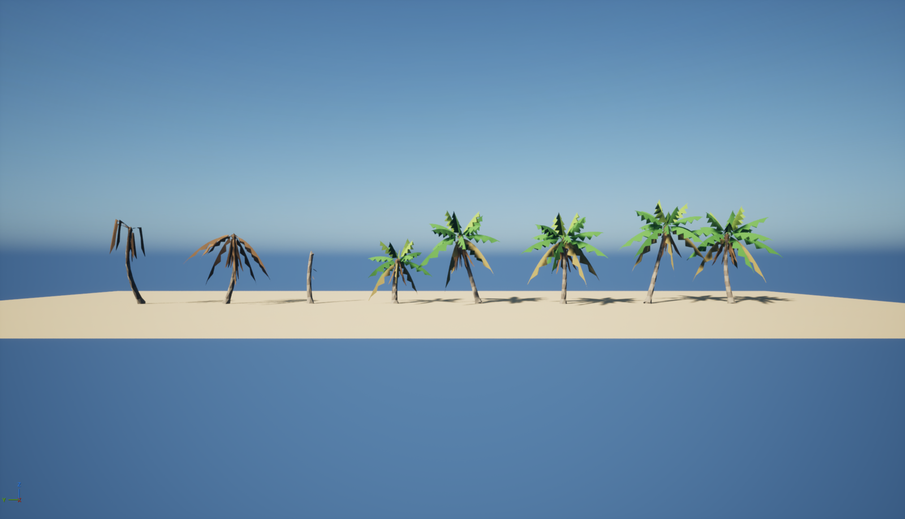

# LowPolyPalms

Low-poly coconut palms: 5 live variants and 3 dead ones, made for Heroes of Benghazi. Flat colours, no textures.

| Mesh | What | Height | Tris (LOD0 / 1 / 2) |
|---|---|---|---|
| SM_Palm_Coco_A | tall, moderate lean | 9.6 m | 921 / 414 / 138 |
| SM_Palm_Coco_B | tallest, strong curved lean | 10.5 m | 893 / 402 / 134 |
| SM_Palm_Coco_C | nearly straight, full crown | 8.7 m | 929 / 418 / 140 |
| SM_Palm_Coco_D | S-curve, heavy dead skirt | 8.9 m | 873 / 392 / 130 |
| SM_Palm_Coco_E | young, short and thick | 6.4 m | 681 / 306 / 103 |
| SM_Palm_Dead_A | bare trunk snapped at 5 m | 5.1 m | 132 / 64 / 64 |
| SM_Palm_Dead_B | dried: every frond hanging brown | 6.7 m | 629 / 284 / 94 |
| SM_Palm_Dead_C | leaning, broken crown | 7.9 m | 322 / 144 / 64 |

Live palms have a curved, tapered, ring-banded trunk; a husk boot and upright spear at the crown; arching fronds
that droop at the tips (young ones light green on top, the oldest yellowing); a skirt of dead brown fronds hanging
below the crown; and coconut clusters. Older fronds are never bigger than the ones above them: the yellowing
ones are 85% of a mature frond and the dead skirt is capped at 90% of the smallest green frond. Z up, centimetres, pivot at the foot of the trunk. No collision.

## Unreal (5.8)

Copy `Unreal/Content/LowPolyPalms` into your project's `Content` folder (it must stay at `/Game/LowPolyPalms`).
It is self-contained: the meshes (3 LODs each), `M_LowPolyPalm` (two-sided, default lit, one `Color` parameter),
one material instance per colour slot, and `Maps/LowPolyPalms_Showcase`. Saved with UE 5.8, so it opens in
5.8 or later only. For older engines, import the FBX files.

To recolour, edit the `MI_Palm_*` instances: TrunkA/TrunkB (bands), Husk, Young, Frond, Old, Dead, Nut.

Good for scatter: use them in a Hierarchical Instanced Static Mesh or foliage tool, cull at around 1.5 km.
In HoB about 15% of placements use a dead variant.

## Other engines / Blender

- `FBX/` — exported from Unreal with LODs, material slots named as above (no colours: assign them yourself,
  see the table below).
- `OBJ/` — OBJ + MTL with the colours as `Kd` (sRGB), LOD0 only. Opens directly in Blender, Godot, Unity.

Fronds are single-sided strips: **use a two-sided material** (or disable back-face culling), or they disappear
from behind.

| Slot | Linear RGB |
|---|---|
| TrunkA | 0.24, 0.20, 0.15 |
| TrunkB | 0.16, 0.13, 0.10 |
| Husk | 0.13, 0.08, 0.04 |
| Young | 0.17, 0.28, 0.04 |
| Frond | 0.06, 0.18, 0.03 |
| Old | 0.22, 0.17, 0.05 |
| Dead | 0.17, 0.09, 0.035 |
| Nut | 0.20, 0.25, 0.04 |

## Making more

`gen_palms.py` (Python 3, no dependencies) regenerates the OBJ/MTL set: `python gen_palms.py [out_dir]`.
New variants are a line each in `VARIANTS` (seed, trunk height, lean, bow, sideways wobble, frond count, dead
skirt count, coconut clusters). Re-import the OBJs into Unreal with your own materials, or replace the meshes in
`/Game/LowPolyPalms/Meshes` (import with the same names to keep the material slots).
